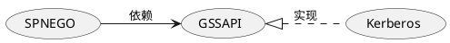
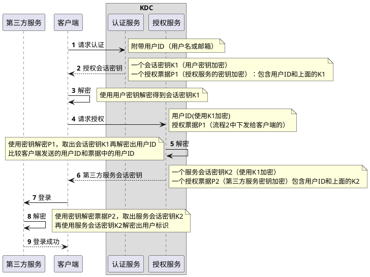
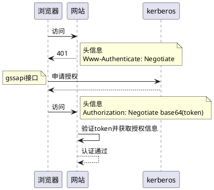
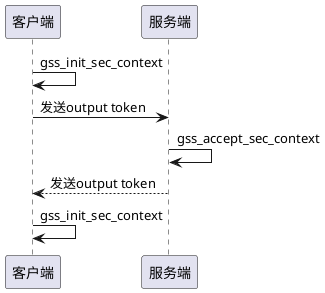

## 概述

GSSAPI 是一种安全机制，定义了通用的安全接口规范。应用可以使用 GSSAPI 创建安全的上下文进行身份验证，而不用关心安全的实现细节。

Kerberos 是一个协议，协议允许使用对称密钥加密在非安全的传输层进行双向身份验证，Kerberos 也代指其具体实现服务程序 MIT Kerberos(krb5)，

SPNEGO 是一种认证协商的协议，用于自动选择认证方式并简化了认证流程，通常选择项是 Kerberos 和 NTLM，可在浏览器中基于 HTTP 协议进行验证。



## Kerberos

由于 Kerberos 是一个比较古老且稳定的协议，并且实现了 GSSAPI 规范，有相当多的应用支持，比如 ssh、pam、nfs、curl、postgresql、mysql、hadoop、chrome、firefox 等。

Kerberos 和 LDAP 的表面区别在于：LDAP 支持同一个密码在多个应用上登录。Kerberos 支持登录一次，在多个应用上使用。

Kerberos 需要一个可信的第三方密钥分发中心（KDC），KDC 包含认证服务和授权服务，他们知道自己的密钥，也知道其他主体的密钥，其他主体只需要知道自己的密钥。



经过授权认证后，客户端信任第三方服务，第三方服务也信任客户端。
使用对称加密存在密码爆破的问题，认证授权过程中加入临时生成的会话密钥减少被攻击的可能性，会话密钥有一段有效期，也能提升性能。

## Kerberos 优缺点

1. 密钥不会被窃听

   密钥不经过网络传播，票据对应到每个主机，内部使用哈希加盐的方式存储密钥。

1. 配置复杂

   服务端配置较为复杂，客户端也需要进行配置。

1. 单点登录

   只需输入密码验证一次，任何使用 geeapi 的应用都可以自动登录。

1. 单点故障

   中心话的方式导致必须保证可用性，否则所有相关应用都会收到影响

1. 兼容性广泛

   可应用于各个基础设施，甚至是操作系统，而不仅仅是 web。

1. 很旧的协议

   九十年代的协议，广泛的应用，意味着更大的攻击范围和更多的攻击工具。

## Kerberos 命令行常用操作

```bash
# 登录
kinit admin/admin@EXAMPLE.COM
# 查看票据
klist
# 登出
kdestroy
# 进入管理员界面
kadmin
    # 创建主体（使用随机密码）
    addprinc -randkey HTTP/b.example.com@EXAMPLE.COM
    # 查看主体列表
    listprincs
    # 导出到密钥表
    ktadd -k b.keytab HTTP/b.example.com@EXAMPLE.COM
```

## SPNEGO 编程

SPNEGO 用于 B/S 在未知对方支持的身份认证协议的情况下，协商认证协议使用的，有微软制定，得到所有主流浏览器支持，安全认证协议一般选项有 NTLM 和 Kerberos，NTLM 因为加密算法太弱，已不推荐使用。

1. SPNEGO 使用 gssapi 接口进行安全认证，并通过 http 头传递认证 token。

1. SPNEGO 提供单点登录但不提供传输加密，需使用 https 保护连接。

1. 网站对接 SPNEGO 不需要和 KDC 通信，但需要配置从 KDC 导出的密钥，用于解密授权 token。



### 范例

这里使用`github.com/jcmturner/gokrb5/v8/spnego`库创建支持 spengo 验证的 http 服务，实例代码可在 https://gitlabwh.uniontech.com/wurongjie/gssapi-example 查看

```golang
package main

import (
	"flag"
	"io/ioutil"
	"log"
	"net/http"

	"github.com/gin-gonic/gin"
	"github.com/jcmturner/goidentity"
	"github.com/jcmturner/gokrb5/v8/keytab"
	"github.com/jcmturner/gokrb5/v8/spnego"
)

const KEY = "creds"

var listen string
var keytabFile string

func main() {
	flag.StringVar(&listen, "l", "", "listen addr")
	flag.StringVar(&keytabFile, "k", "", "keytab file path")
	flag.Parse()
	if len(listen) == 0 || len(keytabFile) == 0 {
		flag.PrintDefaults()
		return
	}

	engine := gin.Default()
	engine.Use(authSPNEGO(keytabFile))
	engine.GET("/", func(c *gin.Context) {
		creds := c.MustGet(KEY).(goidentity.Identity)
		c.JSON(200, gin.H{
			"username":   creds.UserName(),
			"name":       creds.DisplayName(),
			"session_id": creds.SessionID(),
			"auth_at":    creds.AuthTime(),
			"attr":       creds.Attributes(),
		})
	})
	engine.Run(listen)
}

func authSPNEGO(keytabFile string) gin.HandlerFunc {
	kt := keytab.New()
	b, err := ioutil.ReadFile(keytabFile)
	if err != nil {
		log.Println(err)
	}
	err = kt.Unmarshal(b)
	if err != nil {
		log.Println(err)
	}
	return func(c *gin.Context) {
		h := func(rw http.ResponseWriter, r *http.Request) {
			creds := goidentity.FromHTTPRequestContext(r)
			c.Set(KEY, creds)
		}
		spnego.SPNEGOKRB5Authenticate(http.HandlerFunc(h), kt).ServeHTTP(c.Writer, c.Request)
		if _, ok := c.Get(KEY); !ok {
			c.Abort()
		}
		return
	}
}
```

### 使用范例

```base
# 需体检进行登录
kinit admin/admin@EXAMPLE.COM
# curl支持
curl --negotiate -vv -u : http://b.example.com:8080
# chrome支持
google-chrome-stable --auth-server-whitelist="*example.com"
```

## GSSAPI 编程

SPNEGO 仅应用与 http/https 协议中，使用范围有限，更多基于 tcp 的应用则可通过 GSSAPI 编程对接 kerberos

### 客户端开发

1. 初始环境，配置 krb5 user
1. 使用 kinit 命令进行登录
1. 使用 gss_import_name 函数导入服务名
1. 使用 gss_init_sec_context 初始化上下文，获取 output token
1. 将 output token 发送到服务端，并读取返回的 input token
1. 再次执行 gss_init_sec_context 并传入 input token

### 服务端开发

1. 配置密钥路径到环境遍历
1. 接收客户端发送的 input token
1. 使用 gss_accept_sec_context 初始化上下文，并传入 input token
1. 将 output token 发送到客户端

### 调用流程



### 示例

由于代码量过多，不适合贴到文档，可前往https://gitlabwh.uniontech.com/wurongjie/gssapi-example查看

## 参考资料

[GSSAPI 规范](https://tools.ietf.org/html/rfc2743)

[SPNEGO 规范](https://tools.ietf.org/html/rfc4178)

[Kerberos 规范](https://tools.ietf.org/html/rfc4121)

[GSSAPI 编程示例(C 语言)](https://github.com/pbrezina/gssapi-auth)

[GSSAPI 编程示例(CGO 语言)](https://github.com/myml/gssapi-example)

[SPNEGO 编程示例(golang)](https://github.com/myml/gssapi-example)
